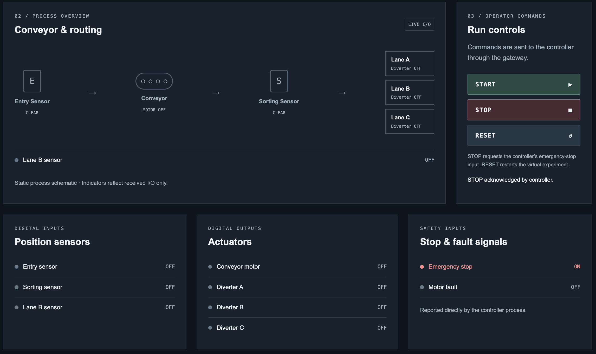

# FactoryFlow

**A small learning and portfolio project that demonstrates PLC-style control through a virtual conveyor.**

FactoryFlow moves one box along a simulated conveyor and routes it to Lane B. A C++ controller makes the control decisions, a Python FastAPI gateway forwards requests, and a React/Next.js screen lets an operator view status and send commands.

The goal is simple: understand how **sensor inputs, control decisions, physical behavior, and an operator interface** fit together while keeping their responsibilities separate.

## Screenshot



The screen displays sensors, the conveyor motor, diverters, and safety inputs. In this screenshot, STOP has activated the emergency-stop input, and the motor and diverters are off.

The conveyor drawing is a static status diagram. The browser does not animate a box or calculate its position.

## What does it do?

The simulator creates one box, `BOX-001`, at the conveyor entrance. Its destination is always **Lane B**.

1. Press **START**. The C++ controller reads the entry sensor and turns on the conveyor motor.
2. The C++ plant simulator updates the box's position.
3. When the box approaches the sorting station, the sorting sensor turns on.
4. The controller activates **Diverter B**, the actuator that directs the box toward Lane B.
5. The Lane B sensor confirms arrival. The controller completes the sequence and turns off all outputs.

```text
IDLE → TRANSPORTING → SORTING → COMPLETE
```

If the emergency-stop or motor-fault input is active, the controller enters `FAULT` and turns off the motor and all diverters.

| Control | Behavior |
| --- | --- |
| START | Starts the current run. After COMPLETE or FAULT, RESET is required first. |
| STOP | Activates the emergency-stop input and causes FAULT. This is not a pause/resume command. |
| RESET | Reinitializes the C++ controller and virtual box, then waits for START. |

Lanes A and C are shown as output signals, but routing to them is outside the current scope.

## How the parts fit together

```text
Next.js HMI               Displays status and accepts operator commands
     ↕ HTTP REST
FastAPI Gateway           Forwards requests and responses
     ↕ TCP / JSON
C++ Controller            Reads inputs and decides actuator outputs
     ↕ Inputs / Outputs
C++ Plant Simulator       Moves the virtual box and generates sensor signals
```

**HMI** means *Human–Machine Interface*: the screen a person uses to monitor and operate a machine. In FactoryFlow, control authority remains in C++.

| Part | Responsibility |
| --- | --- |
| C++ controller | Reads sensor and fault inputs, updates its state, and produces outputs. It never changes box position directly. |
| C++ plant simulator | Applies motor and diverter outputs, updates position, and generates sensor readings. |
| FastAPI gateway | Exposes REST endpoints and forwards commands over TCP. It contains no conveyor or PLC logic. |
| Next.js HMI | Displays telemetry and sends commands. It contains no movement simulation, state transitions, or fault decisions. |

The HMI polls `GET /api/status` approximately every **500 ms**. If valid telemetry is unavailable, it displays **CONTROLLER OFFLINE** and marks signals as UNKNOWN instead of inventing values.

## Where the PLC concepts appear

A **PLC**, or *Programmable Logic Controller*, is used to control industrial equipment. This project uses C++ to explore its basic cyclic execution model without requiring PLC hardware.

```text
Read inputs → scan(inputs) → Calculate outputs → Update virtual plant → Read new inputs
                              Repeat approximately every 10 ms
```

- **Inputs** represent entry, sorting, and Lane B sensors, plus emergency-stop and motor-fault signals.
- **Outputs** represent the conveyor motor and Diverters A, B, and C.
- **`Controller::scan()`** performs one control cycle.
- **State** remembers the current step: IDLE, TRANSPORTING, SORTING, COMPLETE, or FAULT.

The repository also includes an equivalent **IEC 61131-3 Structured Text (ST)** example. ST is a language used to write PLC programs.

See the [PLC mapping guide](docs/plc-mapping.md) and [Structured Text source](plc/FactoryFlow.st). The ST example has not been compiled or run on a PLC runtime.

## Technologies and scope

- **C++20 and CMake:** controller, virtual plant, and TCP interface.
- **Python and FastAPI:** REST-to-TCP gateway.
- **TypeScript, React, and Next.js:** operator HMI.
- **CTest, pytest, and Playwright:** controller, gateway, and browser tests.

This is intentionally a small local demonstration: **one box, one conveyor, and one fixed destination**. It does not include real hardware integration, detailed physics, multiple-box handling, databases, authentication, or cloud deployment.

The approximately 10 ms loop demonstrates cyclic control; it does not provide industrial real-time guarantees or a certified safety system.

## Run locally

The C++ TCP interface targets macOS/Linux. You will need a C++20 compiler, CMake 3.20+, Python 3.10+, Node.js 20.9+, and npm.

### 1. Build and start C++

From the repository root:

```sh
cmake -S . -B build
cmake --build build
./build/factoryflow --serve
```

The C++ process waits for commands on `127.0.0.1:9000`.

To run just the automatic console demonstration, without the gateway or HMI, use `./build/factoryflow` instead.

### 2. Start FastAPI

Open another terminal at the repository root:

```sh
python3 -m venv gateway/.venv
gateway/.venv/bin/python -m pip install -r gateway/requirements.txt
gateway/.venv/bin/python -m uvicorn gateway.main:app --host 127.0.0.1 --port 8000
```

Creating the virtual environment and installing dependencies are first-time setup steps.

### 3. Start the HMI

In a third terminal:

```sh
cd frontend
npm ci
npm run dev
```

Open **http://127.0.0.1:3000** and press START. After completion, press RESET, then START to run again. Stop each process with `Ctrl+C` in its terminal.

## Main files

```text
FactoryFlow/
├── src/
│   ├── Controller.hpp / Controller.cpp  # Input/output definitions and control logic
│   ├── main.cpp                        # Virtual plant and cyclic execution loop
│   └── TcpServer.hpp / TcpServer.cpp    # TCP transport
├── gateway/                            # FastAPI gateway
├── frontend/                           # Next.js HMI
├── plc/FactoryFlow.st                   # Equivalent controller in Structured Text
├── docs/plc-mapping.md                  # Mapping between C++ and PLC concepts
├── tests/                              # C++ tests
└── CMakeLists.txt                      # C++ build configuration
```

For protocol and API details, see [gateway/README.md](gateway/README.md). For HMI behavior and browser testing, see [frontend/README.md](frontend/README.md).

## Tests

After building C++, run these commands from the repository root. Stop any manually started C++ `--serve` process first, because the gateway integration tests launch their own server on port 9000.

```sh
ctest --test-dir build --output-on-failure
gateway/.venv/bin/python -m pytest gateway/tests -q
```

With Next.js running, run the browser tests from `frontend/`:

```sh
npx playwright install chromium
npm test
```

For an end-to-end check, run C++, FastAPI, and Next.js, then execute:

```sh
LIVE_HMI=1 npm test -- tests/live.spec.ts
```

The live test sends START, STOP, and RESET through the HMI and checks that the box reaches Lane B.

## Learning background and AI assistance

I already had knowledge of **C++, Python, and React** before starting this project. I used that foundation to explore industrial control concepts through a small working example.

I used **AI (LLM) assistance** to learn and apply topics that were newer to me, particularly **PLC scan cycles, industrial input/output concepts, IEC 61131-3 Structured Text, and modern C++ features and C++20 usage**. AI also assisted with implementation, code organization, testing, and documentation.

This project is a learning record and portfolio demonstration that connects existing programming knowledge with new control concepts. AI was used as a development and learning tool; **the running FactoryFlow application contains no AI functionality**.
